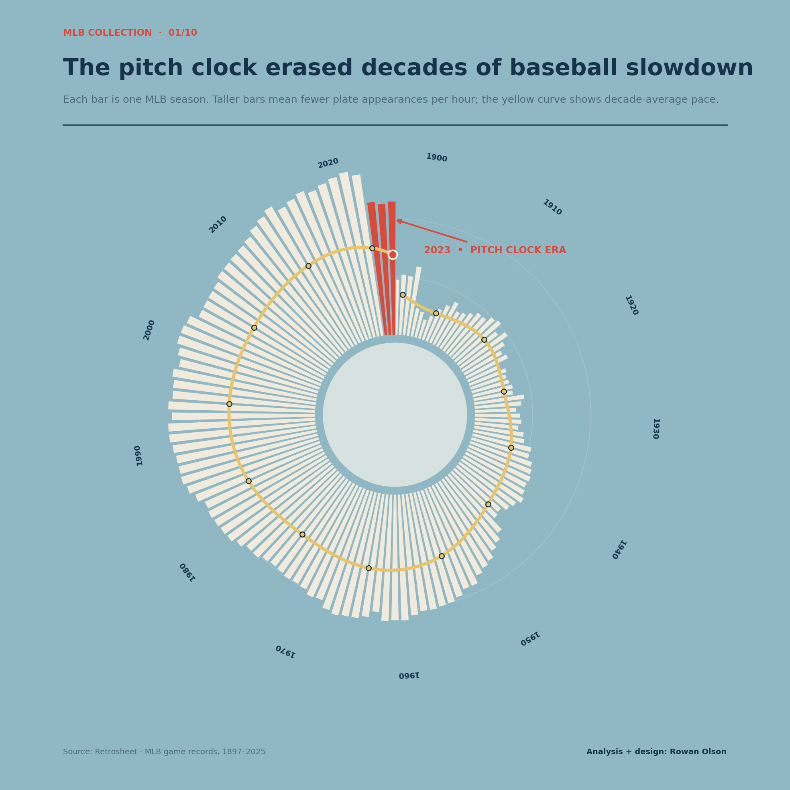
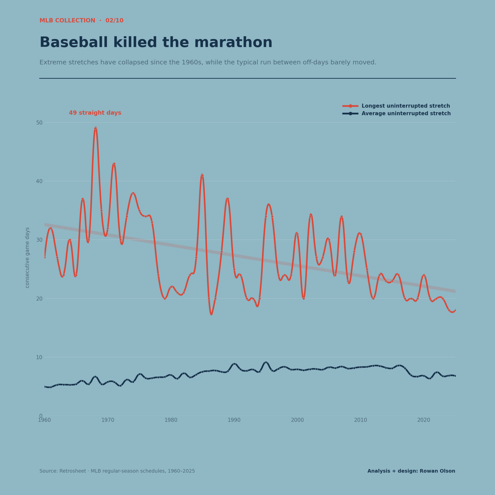
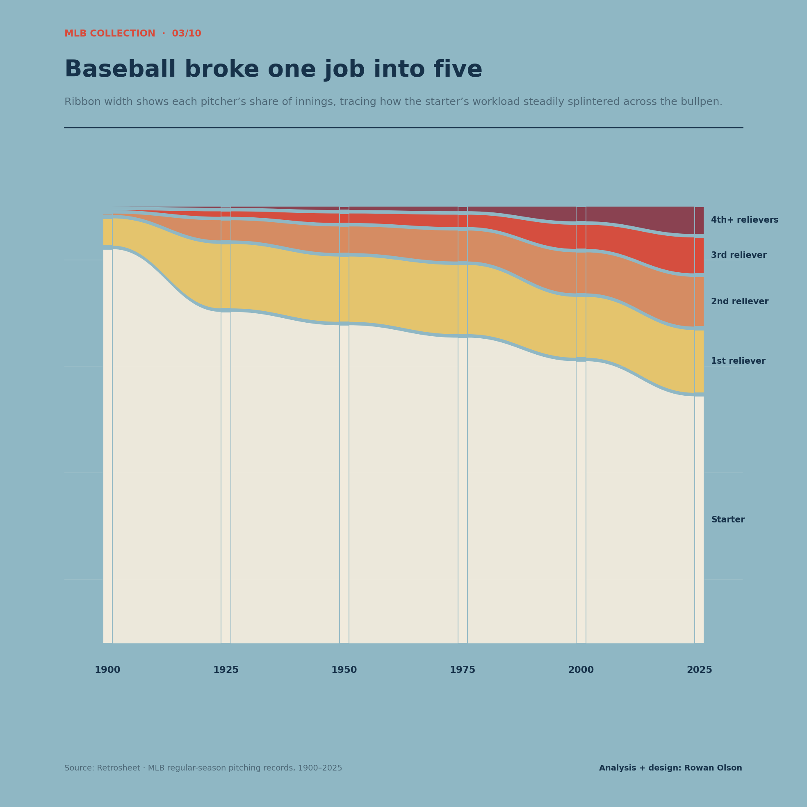
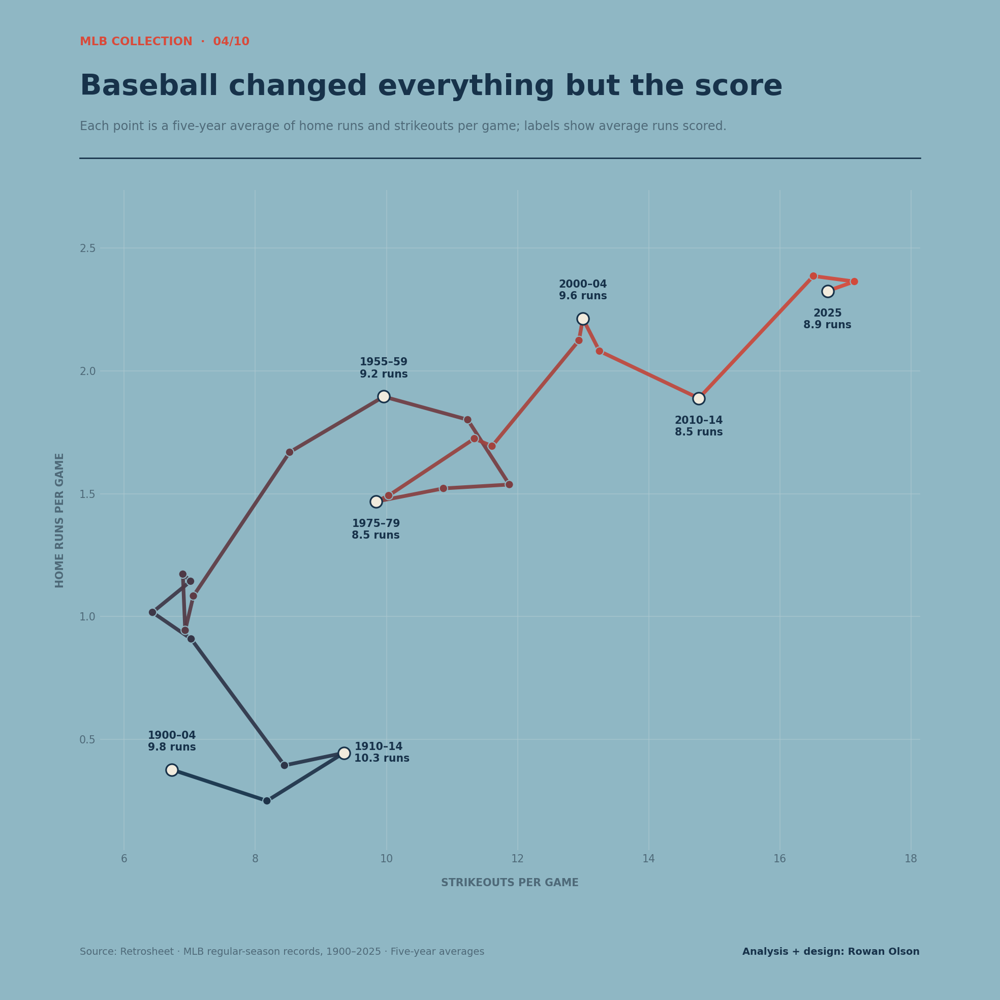
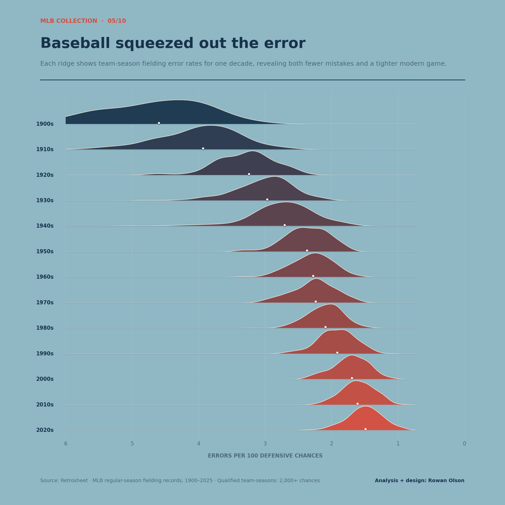
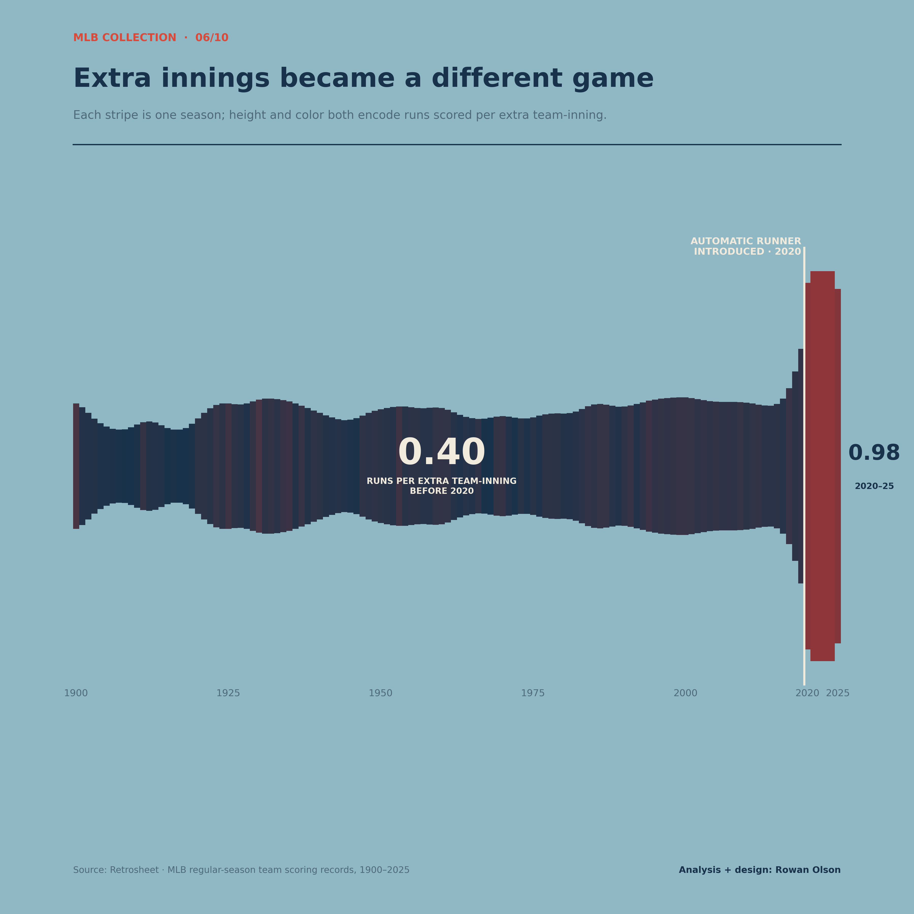
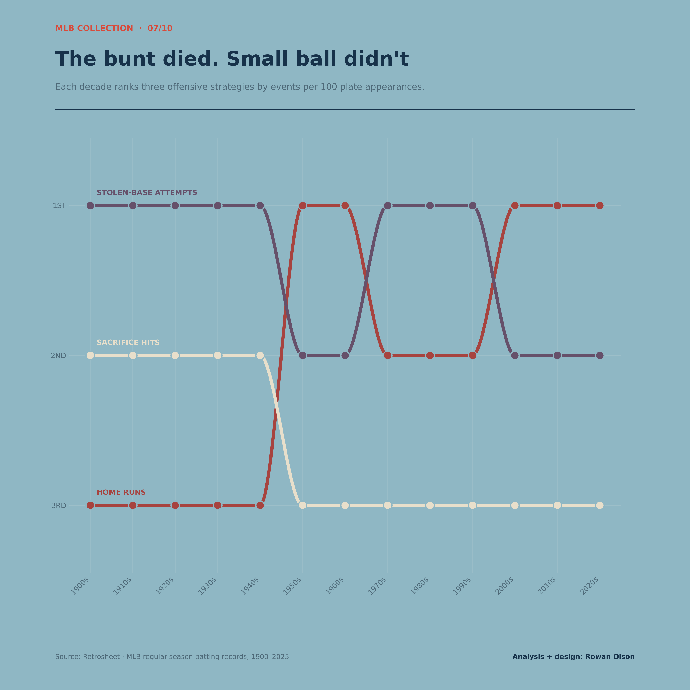
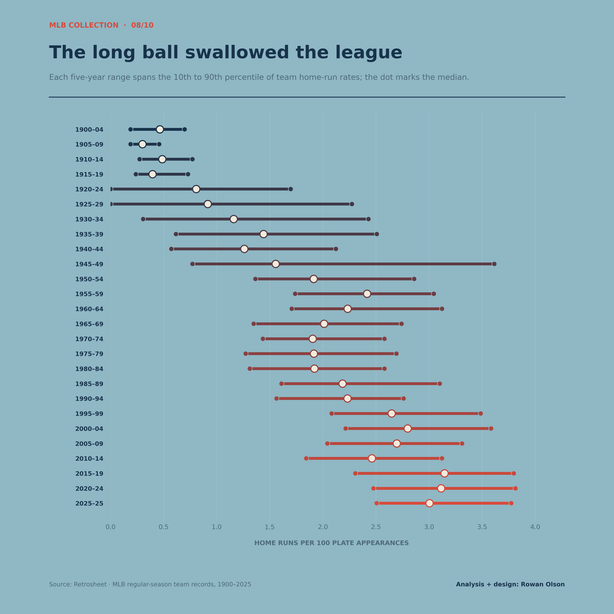
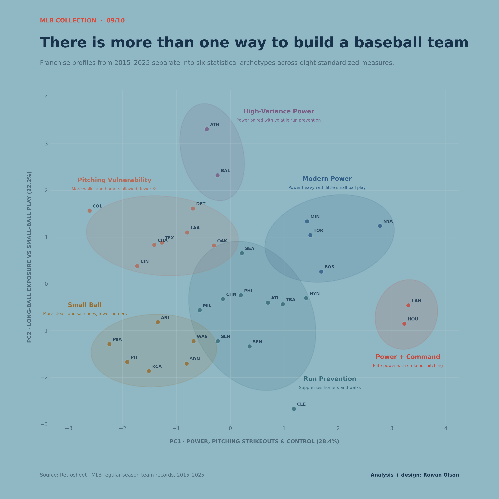
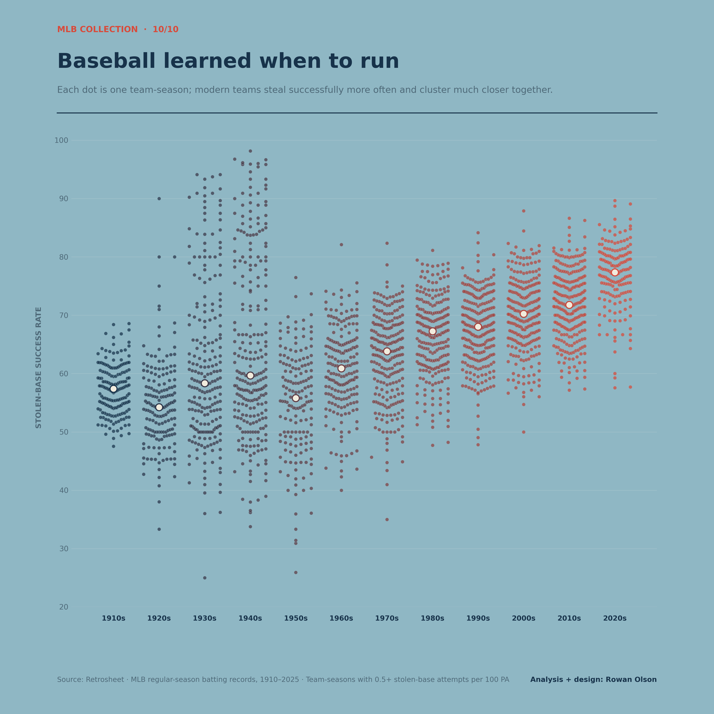

# MLB Collection

Ten charts exploring how Major League Baseball changed from 1900 to 2025.

Using historical data from Retrosheet, this collection looks beyond wins, losses, and individual records to examine how the structure and strategy of baseball evolved over more than a century. Each chart isolates a different part of the game, from pace of play and pitching roles to offensive strategy, fielding, extra innings, and stolen bases.

Together, the charts tell a broader story: baseball did not simply become more or less offensive, aggressive, or efficient. The game changed how it produces largely familiar outcomes. Pitchers became more specialized, errors disappeared, home runs spread across the league, bunting collapsed, stolen bases became more selective, and the pitch clock reversed decades of slowdown. The rules, strategies, and statistical shape of baseball changed enormously even when the scoreboard sometimes did not.

## Data

All data used in this project comes from Retrosheet.

[All Players](_allplayers.csv) - Basic information about all players divided by team-season.

[Game Information](_gameinfo.csv) - Game-level information including teams, attendance, umpires, and other game details.

[Team Statistics](_teamstats.csv) - Team-level information including line scores, lineups, batting, pitching, and fielding statistics.

[Batting](_batting.csv) - Batting statistics by player by game.

[Pitching](_pitching.csv) - Pitching statistics by player by game.

[Fielding](_fielding.csv) - Fielding statistics by player by position by game.

---

## 01 - The pitch clock erased decades of baseball slowdown

Baseball spent decades gradually slowing down as fewer plate appearances were squeezed into each hour of play. The introduction of the pitch clock in 2023 abruptly reversed that trend, returning the pace of the game to territory baseball had not occupied in decades.

[View code](pitchclock.py)

---

## 02 - Baseball killed the marathon

The average uninterrupted stretch of games between off-days has changed surprisingly little, but the extremes have disappeared. Where teams once endured stretches approaching 50 consecutive games, modern scheduling has largely eliminated baseball's longest marathons.

[View code](streaks.py)

---

## 03 - Baseball broke one job into five

Pitching was once overwhelmingly the starter's job. Over the following century, that workload steadily fractured across increasingly deep bullpens, turning one dominant pitching role into a sequence of specialized ones.

[View code](pitchshift.py)

---

## 04 - Baseball changed everything but the score

Strikeouts and home runs transformed the shape of MLB offense, but scoring did not transform with them. Five-year snapshots show baseball migrating toward dramatically more strikeouts and home runs while average runs scored repeatedly return to familiar territory.

[View code](offense.py)

---

## 05 - Baseball squeezed out the error

Fielding errors did not merely become less common. Their entire distribution compressed. Early baseball produced both higher error rates and enormous variation between teams, while the modern game clusters tightly around much lower rates.

[View code](errors.py)

---

## 06 - Extra innings became a different game

For more than a century, scoring in extra innings remained remarkably stable. The automatic runner rule introduced in 2020 broke that pattern immediately, producing a sharp increase in runs per extra team-inning and fundamentally changing how extra-inning baseball behaves.

[View code](extras.py)

---

## 07 - The bunt died. Small ball didn't

Baseball's offensive hierarchy changed dramatically across the decades. Sacrifice hits collapsed from a central strategy to a distant third, but stolen-base attempts repeatedly resurfaced as a major offensive tool even as home runs became dominant.

[View code](strategy.py)

---

## 08 - The long ball swallowed the league

Home runs became more common across nearly the entire league, not just among its biggest sluggers. Five-year distributions show both the typical team and the broader range of team home-run rates marching steadily upward until power became a defining feature of modern baseball.

[View code](winningrecipe.py)

---

## 09 - There is more than one way to build a baseball team

Recent MLB franchises separate into six statistical archetypes when their offensive style, baserunning, small-ball tendencies, and pitching profiles are considered together. The clusters reveal distinct approaches ranging from modern power and run prevention to small ball, pitching vulnerability, and unusually volatile power.

[View code](teamidentity.py)

---

## 10 - Baseball learned when to run

Stolen-base attempts have risen and fallen throughout baseball history, but teams have become increasingly selective about when they run. Modern team-seasons cluster around substantially higher success rates, suggesting that baseball did not simply abandon or rediscover the stolen base. It got better at choosing when to use it.

[View code](stealsuccess.py)